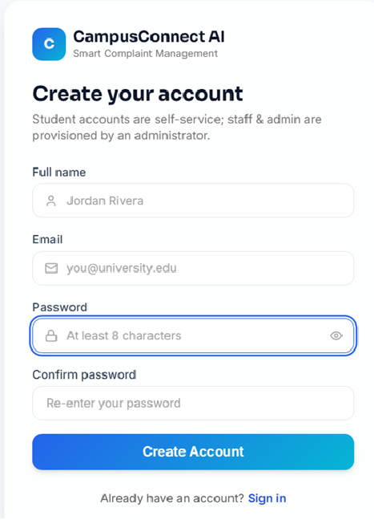
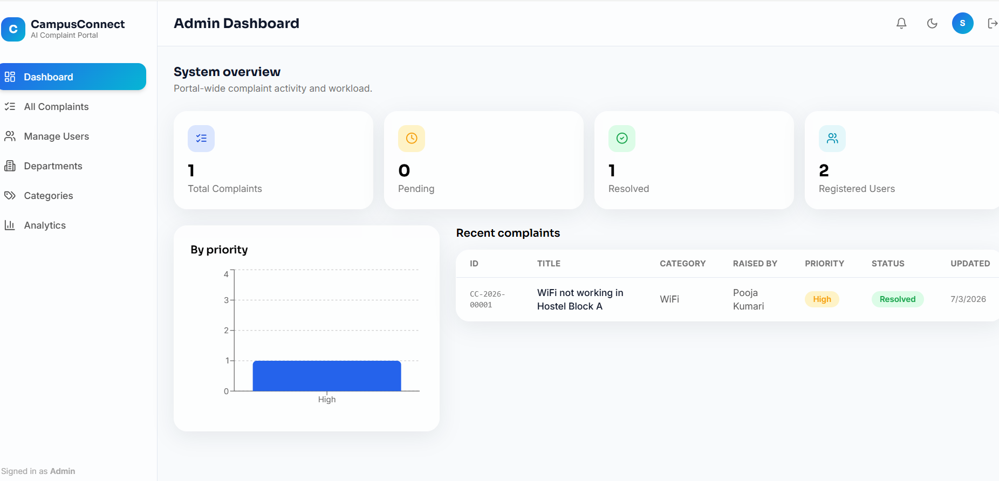
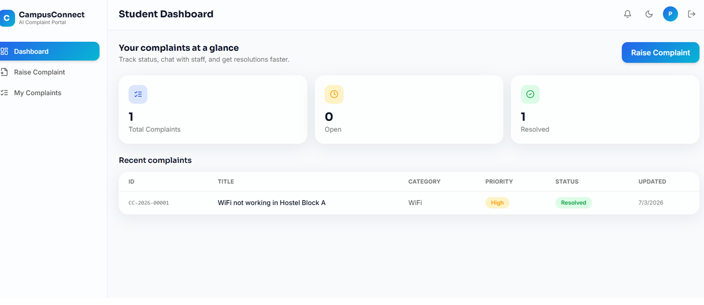
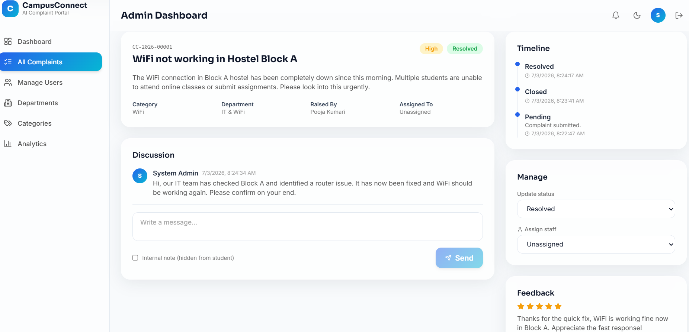

# CampusConnect AI — Smart Complaint Management Portal

A role-based (Student / Staff / Admin) complaint management system built on the MERN stack.

**This is Phase 1 + 2 of the full product spec**: authentication and the complete complaint
workflow are real, working, end-to-end code — not placeholders. Real-time chat, AI
classification, and deeper admin tooling are the next phases (see [Roadmap](#roadmap)).

---

## Screenshots

**Login Page**


**Admin Dashboard**


**Student Dashboard**


**Complaint Detail**


## What's included right now

**Auth**
- Register (student self-service) / Login / Logout
- JWT access tokens + httpOnly refresh token cookie, with automatic silent refresh on the client
- Role-based route protection (student / staff / admin) on both API and frontend
- Forgot / reset password flow (token-based; email sending is stubbed for you to wire up an email provider)
- Change password

**Complaints**
- Raise a complaint with category, priority, and up to 5 file attachments (images/PDF)
- Auto-generated human-readable complaint codes (`CC-2026-00001`)
- Full status lifecycle with an audit timeline (Pending → Assigned → In Progress → Waiting for
  User → Resolved / Closed / Rejected)
- Comments/discussion thread per complaint, with staff-only internal notes
- Admin can assign complaints to staff by department
- Student feedback (star rating + comment) once resolved
- Search, filter by status/category/department/priority, and pagination
- Analytics summary endpoint (totals, by status, by priority) powering dashboard charts

**Platform**
- Helmet, rate limiting (global + stricter on auth), CORS, mongo-sanitize, input validation
- Secure password hashing (bcrypt, 12 rounds)
- Multer file uploads with type/size limits
- Socket.IO server is wired up (JWT-authenticated handshake, per-user rooms, per-complaint chat
  rooms) and ready for the chat UI to be connected in the next phase
- Clean MVC structure, consistent API response/error envelopes
- Seed script that creates an admin account plus starter departments/categories

**UI**
- React 18 + Vite + Tailwind, glassmorphism cards, dark/light mode, Sora + Inter type system
- Role-specific dashboards with charts (Recharts), loading skeletons, and empty states
- Fully responsive layout (mobile sidebar collapses; forms and tables adapt)

---

## Tech stack

| Layer | Choice |
|---|---|
| Frontend | React 18, Vite, Tailwind CSS, React Router, TanStack Query, React Hook Form, Axios, Framer Motion, Recharts, React Toastify, Lucide Icons |
| Backend | Node.js, Express.js |
| Database | MongoDB (Atlas or local), Mongoose |
| Auth | JWT (access + refresh), bcrypt |
| Real-time | Socket.IO (server wired, client wiring is next phase) |

---

## Folder structure

```
campusconnect-ai/
├── client/                 # React + Vite frontend
│   └── src/
│       ├── components/     # ui/, layout/, complaints/
│       ├── contexts/       # AuthContext, ThemeContext
│       ├── layouts/        # DashboardLayout
│       ├── pages/          # student/, staff/, admin/, auth pages
│       ├── routes/         # ProtectedRoute
│       ├── services/       # api.js (axios + refresh), authService, complaintService
│       └── utils/
└── server/                 # Express API
    ├── config/             # db.js, multer.js
    ├── controllers/
    ├── middlewares/        # auth, errorHandler, validate
    ├── models/             # User, Department, Category, Complaint, Comment
    ├── routes/
    ├── utils/              # asyncHandler, apiError, apiResponse, generateTokens, seed.js
    └── uploads/             # local file storage (gitignored)
```

---

## Getting started

### 1. Prerequisites
- Node.js 18+
- A MongoDB connection string (a free [MongoDB Atlas](https://www.mongodb.com/atlas) cluster works, or run MongoDB locally)

### 2. Backend

```bash
cd server
npm install
cp .env.example .env
# edit .env: set MONGO_URI, JWT_ACCESS_SECRET, JWT_REFRESH_SECRET (long random strings)
npm run seed     # creates an admin account + starter departments/categories
npm run dev      # starts on http://localhost:5000
```

Seeded admin login: **admin@campusconnect.ai / Admin@12345** — change this password immediately
after first login in a real deployment.

### 3. Frontend

```bash
cd client
npm install
cp .env.example .env   # defaults already point at localhost:5000
npm run dev             # starts on http://localhost:5173
```

Open `http://localhost:5173`, register a student account, or log in as the seeded admin to
create departments/categories and manage the system.

---

## API overview

All endpoints are prefixed with `/api`. Every route except `/auth/*` and `/health` requires an
`Authorization: Bearer <accessToken>` header.

| Module | Endpoints |
|---|---|
| Auth | `POST /auth/register`, `/login`, `/refresh`, `/logout`, `GET /auth/me`, `POST /auth/forgot-password`, `/auth/reset-password/:token` |
| Users | `GET /users` (admin), `GET /users/staff`, `PATCH /users/:id`, `PATCH /users/me/password` |
| Complaints | `POST /complaints`, `GET /complaints`, `GET /complaints/:id`, `PATCH /complaints/:id/status`, `PATCH /complaints/:id/assign`, `POST /complaints/:id/comments`, `POST /complaints/:id/feedback`, `DELETE /complaints/:id`, `GET /complaints/analytics/summary` |
| Departments | `GET/POST /departments`, `PATCH/DELETE /departments/:id` |
| Categories | `GET/POST /categories`, `PATCH/DELETE /categories/:id` |

Every response follows `{ success, message, data }` on success or `{ success, message, errors }`
on failure.

---

## Deployment

- **Frontend → Vercel**: set the project root to `client/`, build command `npm run build`, output
  `dist/`. Set `VITE_API_URL` and `VITE_SOCKET_URL` to your deployed backend URL.
- **Backend → Render**: set the project root to `server/`, build command `npm install`, start
  command `npm start`. Set all variables from `.env.example` in Render's environment settings,
  and set `CLIENT_URL` to your deployed Vercel URL.
- **Database → MongoDB Atlas**: create a free cluster, add your Render backend's IP (or `0.0.0.0/0`
  for simplicity while testing) to the network access list, and use the connection string as
  `MONGO_URI`.

---

## Roadmap

This build covers Phase 1 (foundation) and Phase 2 (core complaint workflow) of the full spec.
Not yet implemented — happy to build these in follow-up passes:

- Real-time chat UI wired to the existing Socket.IO server, typing indicators, read receipts
- AI features: complaint classification, priority prediction, summarization, duplicate detection,
  suggested replies, chatbot (Gemini/OpenAI integration)
- Email notifications (email verification, password reset, status change emails)
- Excel/PDF export, QR code complaint receipts, PDF receipts
- Activity logs, system settings, department-wise/staff-wise analytics
- Docker Compose, GitHub Actions CI/CD
- Multi-language support (English/Hindi), PWA support
- Automated test suite

---

## Notes for evaluators / portfolio use

- No placeholder/TODO logic in what's implemented — every route above is fully functional against
  a real MongoDB instance.
- Security basics (hashing, rate limiting, sanitization, helmet, CORS, validation) are in place
  from day one rather than bolted on later.
- The codebase is intentionally scoped to be extendable: the AI, chat UI, and export features
  slot into the existing controller/route/service structure without refactoring what's here.
